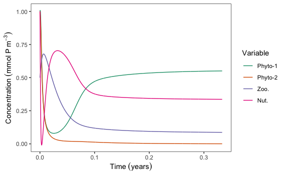

<!-- Section -->
<section>
	<header class="major">
		<h2>Example Code</h2>
	</header>
	

		<article>
			<h3>Introduction to theoretical modeling of phytoplankton communities</h3>
			
			
I was asked to give a guest lecture to undergraduates about modelling phytoplankton communities. Here I walk through a simple example of writing our equations, defining the parameters, setting up a for loop, and visualizing the output using base R and ggplot. I work up to a more "realistic" NPZ (Nutrients-Phytoplankton-Zooplankton) model and ask how changing parameters such as growth rate and nutrient uptake efficiency influences community dynamics.

			<ul class="actions">
				<li><a href="{{ 'modelling_phytoplankton_communities.html' | absolute_url }}" class="button">Full Description</a></li>
        <li><a href="https://github.com/anoelsm/intro-theoretical-modelling" class="button">GitHub Repository</a></li>
			</ul>
		</article>
		<!--- Break --->
	

</section>
