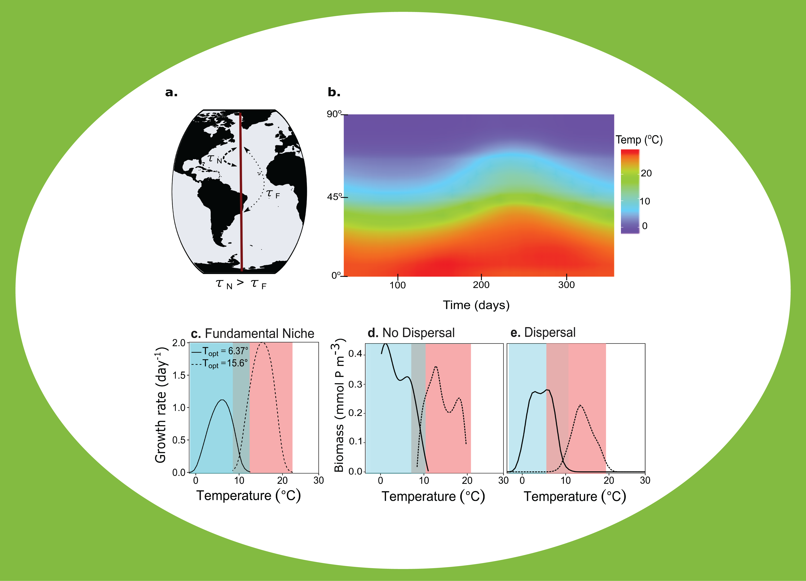
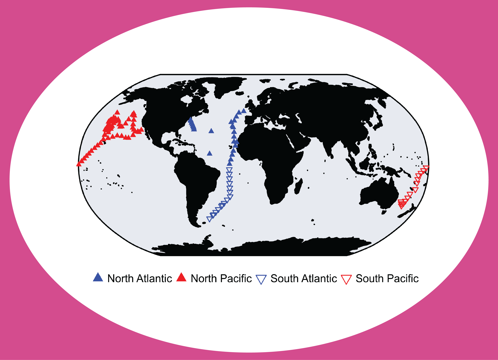
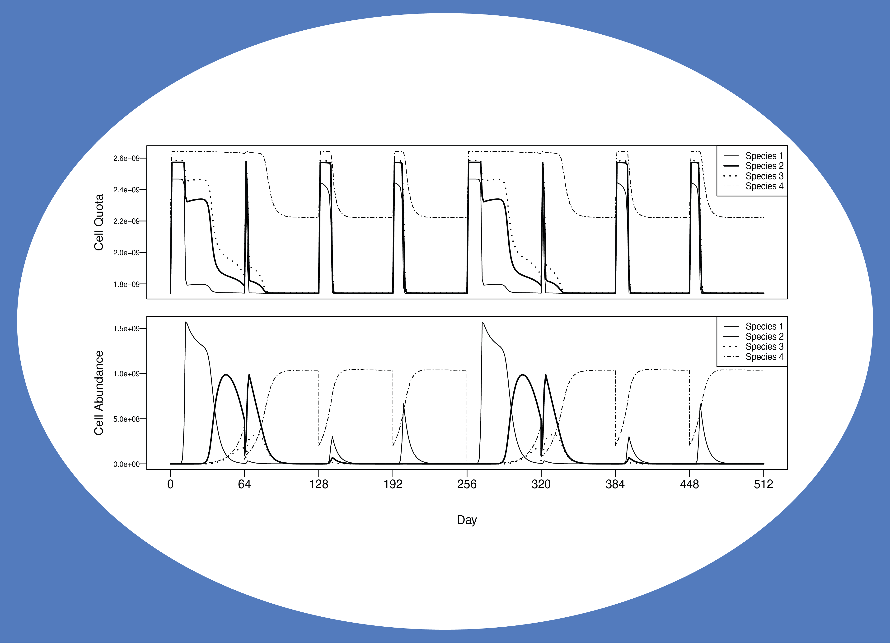

<!-- Section -->
<section>
	<header class="major">
		<h2>Skills</h2>
	</header>
	

		<article>
			
			

				<h3>Data management and quality control</h3>
				
I enjoy conducting quality control analyses and exploring novel datasets.

			

		</article>
		<article>
			
			

				<h3>Data visualization</h3>
				
I am constantly striving to improve on my data visualization skills. I make most of my figures using ggplot2 but also have experience in Adobe Illustrator.

			

		</article>
		<article>
			
			

				<h3>R</h3>
				
Over 8 years of experience in theoroetical modeling and statistical analysis in R. Additionally, I have experience in MatLab, Python, Shell scripting, and LaTeX. I enjoy staying on top of technological and methodological advancements and learning new languages.

			

		</article>
		<article>
			
			

				<h3>Science communication</h3>
				
Effective science communicator with three peer-reviewed publications and multiple successful oral presentations at international conferences. 

			

		</article>
	

</section>

<!-- Section -->
<section>
	<header class="major">
		<h2>Projects</h2>
	</header>
	

		<article>
			
			<h3>Effects of temperature variability and dispersal on phytoplankton realized temperature niches</h3>
			
Phytoplankton species exhibit fundamental temperature niches that drive observed species distributions linked to realized temperature niches. A recent analysis of field observations of <i>Prochlorococcus</i> showed that for all ecotypes, the realized niche was, on average, colder and wider than the fundamental niche. Using a simple trait-based metacommunity model that resolves fundamental temperature niches for a range of competing phytoplankton, we ask how dispersal and local temperature variability influence species distributions and diversity, and whether these processes help explain the observed discrepancies between fundamental and realized niches for <i>Prochlorococcus</i>.

			<ul class="actions">
				<li><a href="{{proj3.html | absolute_url}}" class="button">More</a></li>
			</ul>
		</article>
		<article>
			
			<h3>Comparing <i>Prochlorococcus</i> temperature niches in the lab and across ocean basins</h3>
			
Niche theory suggests that the realized niche occupied by an organism in the field is a subset of the fundamental niche space of the organism, absent additional biotic and abiotic factors. Though often assumed, this discrepancy is rarely tested for specific organisms, and could act as a source of error in model predictions of biogeographical shifts resulting from temperature change which assume niche theory constraints. Here, we quantify the difference between fundamental and realized temperature niches for four dominant ecotypes of Prochlorococcus, including eMED4, eMIT9312, eMIT9313, and eNATL2A, and ask whether the realized temperature niches of each ecotype vary across ocean basins. 

			<ul class="actions">
				<li><a href="{{proj2.html | absolute_url}}" class="button">More</a></li>
			</ul>
		</article>
		<article>
			
			<h3>Effects of multiple timescales of resource supply on the maintenance of species and functional diversity</h3>
			
It is well known that variable resource supply can allow competitors to coexist on a single limiting resource, and this is one mechanism that may explain the maintenance of diversity in paradoxically speciose communities. Ecosystems experience fluctuations in resource supply on a range of timescales, but we have a poor understanding of how multiple frequencies of resource supply affect the maintenance of diversity and community structure. Here we explore this question using a model of phytoplankton competition for a limiting nutrient, parameterized using empirical tradeoffs between rapid growth, nutrient storage capacity and nutrient uptake affinity. 

			<ul class="actions">
				<li><a href="{{proj1.html | absolute_url}}" class="button">More</a></li>
			</ul>
		</article>
	

</section>
