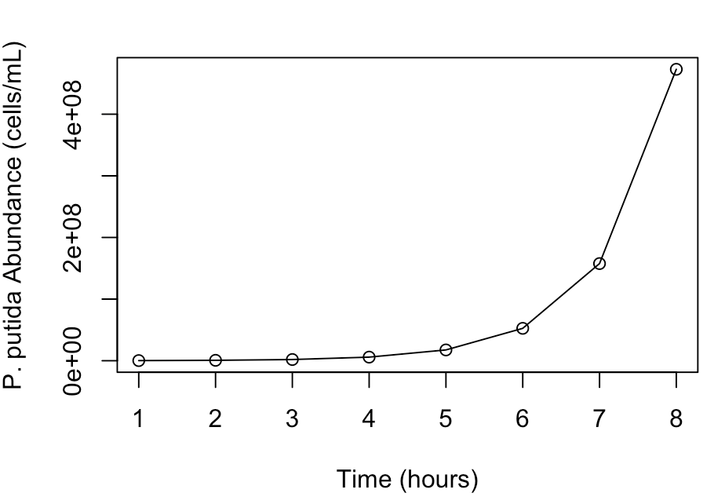
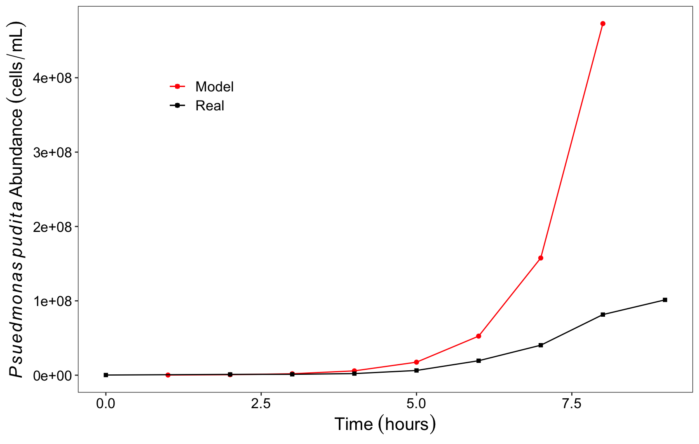
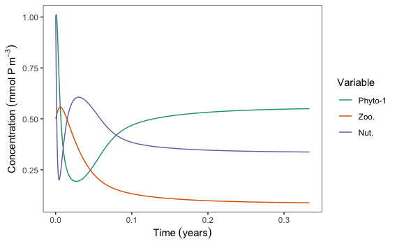
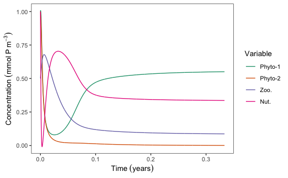

<h2>Introduction</h2>

In 2021, I was asked to do a guest lecture on modelling in R. I created a presentation and a lab exercise from scratch. If you are interested, the following walk through explains how to develop a theoretical model. This is the basis of some of my modeling work such as that seen in <a href = "{{ 'Smith&Edwards-2019.html' | absolute_url }}">Smith and Edwards (2019). <i>Oikos</i></a>.  
There are a number of different types of models but here I am mostly focusing on theoretical modeling of phytoplankton communities which involves, as I understand it, developing mathematical equations or frameworks based on fundamental principles and assumptions to describe and predict the behavior of a system. Here, I walk through how to build a basic NPZ (Nutrient-Phytoplankton-Zooplankton) model from scratch first starting with a very simple model of the biomass accumulation of a single bacterial taxa growing in culture.

<blockquote>Whilst I created the code and the presentation myself I had help and influences from outside sources that I would like to give credit to. <a href="https://sites.google.com/site/kyleedwardsresearch/">Dr. Kyle Edwards</a>  was my undergraduate mentor and the co-author of my first paper. Most of my basic knowledge of R and theoretical modelling comes from working with him. <a href="https://adbarton.scrippsprofiles.ucsd.edu/">Dr. Andrew Barton</a>  was my Ph.D. advisor and some of the framework I used to build the simple model (i.e. the comparing to "real" data) comes from a class he taught. And finally, <a href="https://www.polarmicrobes.org/">Dr. Jeff Bowman</a> is the instructor who's class I was presenting this to and he turned my R code into a nice clean R markdown file which was the basis for the lab exercises. Some of the explanation and questions below come from him.</blockquote>

<h2>A simple model</h2>

The basic steps in developing any theoretical model is to start with understanding the theory(ies) that describe the system you are trying to model and then determining the equations that best represent that system. For example, the basic theory in this simple model is that you can calculate or predict changes in microbial population abundance over time if you know the growth rate. Phytoplankton consume nutrients at soThe basic equation here is: ${dP \over dt} = Pr$ where <i>P</i> stands for population, <i>t</i> stands for time, and <i>r</i> stands for growth rate. Obviously this is not how natural systems really operate but if conditions are perfect and there are no outside influences, then populations will continue to increase as fast as they can grow. 

So now that we know the equation, we can build the model. To do this we need to turn the equation into "code speak" which is basically putting it all onto one line and moving the known values to the right side of the equation leaving the unknown values (i.e. the ones we are theorizing) to the left. We can rewrite the equation to the following: ${P_{t=n} - P_{t=0} \over \Delta t} = P_{t=0}r$. The two equations are saying the same thing where the change in population ($dP$) is the different between the abundance at time point 0 ($P_{t=0}$) and the population at the next time point ($P_{t=n}$). In this example, we are trying to model the population of a given microbe over time so the output we are looking for is $P_{t=n}$. We can rearrange the equation to: $P_{t=n} = P_{t=0} + \Delta t*P_{t=0}r$ and in R that looks like this where I use $i$ instead of $n$ so $i$ stands for the current time point and $i-1$ represents the previous time point:

<pre><code>library(ggplot2)
library(reshape)
P[i] = P[i-1] + (dt*P[i-1]*r)
</code></pre>

So now we have developed some model parameters that we need to define. We are trying to calculate the population at some future time point but we need to know the population size at the previous time point ($P[i-1]$), how much time has passed ($dt$), and the growth rate ($r$). In some cases you might know all of these values from previous research and in other cases you might not know any of these values and need to make educated estimates and try different values. This is where the "theoretical" part comes in. Microbes, for example, grow very fast because they are small, single-celled organisms, so it is a reasonable estimate that the population can double in hours but this value is specific to different organisms. Let's take <i>Pseudomonas putida</i> as an example. A reasonable population size of <i>P. putida</i> is $0.2161x10^6 cells/mL$ so let's test out the model and theorize what the population might look like after 9 hours. To do this we are going to create a <i>for loop</i> which will allow us to calculate the above equation over time steps and save the output at each iteration.

<pre><code>for (i in 2:iter){
  P[i] = P[i-1] + (dt*P[i-1]*r)
}
</code></pre>

At each iteration, $i$ will be replaced by some number determined from $2:iter$ where $iter$ will be the full length of time we want to calculate. Since we are calculating the population size at the next time point, we start at $i = 2$. First we setup an empty vector where we will save the output then fill in all of the other parameters we want.

<pre><code>P = vector(length=iter) #setting up an empty vector
P[1] = 0.2161x10^6 #Making the first value in P the starting abundance 0.2161x10^6 cells/mL
dt = 1 #Let's calculate the change in abundance every hour
iter = 9 #Let's calculate the abundance at each hour until hour 9
time_vec = 1:iter #Create a vector of time values
</code></pre>

Before we begin, we need to hypothesize what the growth rate ($r$) of this population might be. We know microbes grow fast so we might estimate that the growth rate is 2 hours meaning that the population of this species will double in 2 hours. If we set $r = 2$ then we can run the model and see what the population looks like. 

<pre><code>plot(time_vec,P, ty="l", ylab = "P. putida Abundance (cells/mL)", xlab = "Time (hours)")
points(time_vec,P)
</code></pre>

	
<b>Figure 1.</b> <i>Pseudomonas putida</i> abundances (cells/mL) over time (hours) plotted using base R plotting functions.

The above is plotting in base R, but to plot in ggplot2, try the following:

<pre><code>ggplot()+
  geom_line(aes(x=time_vec,y=P))+
  geom_point(aes(x=time_vec,y=P))+
  scale_x_continuous(name=bquote(Time~(hours)))+
  scale_y_continuous(name=bquote(italic(Psuedmonas~pudita)~Abundance~(cells/mL))+
  theme_bw()+
  theme(panel.grid = element_blank(),
        legend.position = c(0.2,0.8),
        text = element_text(size=16),
        axis.text = element_text(color='black'))
</code></pre>

We can see that with this equation, the population exponentially increases over time. Now let's compare to some "real" data. Laboratory data measuring the change in <i>P. putida</i> might look like this: 

	

		<table>
			<thead>
				<tr>
					<th>Time (hours)</th>
					<th>Abundance (cells/mL x $10^6$)</th>
				</tr>
			</thead>
			<tbody>
				<tr>
					<td>0</td>
					<td>0.2161</td>
				</tr>
				<tr>
					<td>2</td>
					<td>1.0808</td>
				</tr>
				<tr>
					<td>3</td>
					<td>1.1867</td>
				</tr>
				<tr>
					<td>4</td>
					<td>2.1595</td>
				</tr>
				<tr>
					<td>5</td>
					<td>6.3756</td>
				</tr>
				<tr>
					<td>6</td>
					<td>19.4565</td>
				</tr>
				<tr>
					<td>7</td>
					<td>40.3202</td>
				</tr>
				<tr>
					<td>8</td>
					<td>81.5114</td>
				</tr>
				<tr>
					<td>9</td>
					<td>101.2929</td>
				</tr>
			</tbody>
		</table>
	

	
 

Let's plot this and see how it compares to our simple model. 

<pre><code>P_putida_time=c(0,2,3,4,5,6,7,8,9)
P_putida_abundance=c(0.2162, 1.0808, 1.1867, 2.1595, 6.3756, 19.4565, 40.3202, 81.5114, 101.2929)*1e6
ggplot()+
  geom_line(aes(x=time_vec,y=P,col='Model'))+
  geom_point(aes(x=time_vec,y=P,col='Model'))+
  geom_line(aes(x=P_putida_time,y=P_putida_abundance,col='Real'))+
  geom_point(aes(x=P_putida_time,y=P_putida_abundance,col='Real'),shape='square')+
  scale_x_continuous(name=bquote(Time~(hours)))+
  scale_y_continuous(name=bquote(italic(Psuedmonas~pudita)~Abundance~(cells/mL)))+
  scale_color_manual(name='',values=c('Real'='black','Model'='red'))+
  theme_bw()+
  theme(panel.grid = element_blank(),
        legend.position = c(0.2,0.8),
        text = element_text(size=16),
        axis.text = element_text(color='black'))
</code></pre>

<b>Figure 2.</b> <i>Pseudomonas putida</i> abundances (cells/mL) over time (hours) plotted using ggplot2 plotting functions.

Our simple model and hypothesis that the growth rate is 2 hours, looks like it matches "real" data up until hour 4 and then the model data shows much greater population estimates than the real data. So now, you have a working model that estimates exponential population increase. Spend some time considering the structure of the model. We used a for loop to iterate over different input values - we could have thousands or even millions of different inputs - but the real work is done by the formula embedded in the for loop. What doublings per day value most closely matches the observations?

<blockquote>
Note that the model values don’t quite match the observed values. Play with the parameter r to identify the value that most closely matches the observations.
</blockquote>

<ul class="accordion">
	<li><input id="accordion{{ forloop.index }}" type="checkbox" class="ac"/>
		<label for="accordion{{ forloop.index }}">
			Which r value gets you closest to the "real" data?
		</label>
		
If you test out different $r$ values then you might have realized that an $r$ value of around 1.3 matches the "real" data trend quite well. Meaning that the population grows more slowly than we initially hypothesized.
		

	</li>
	<li><input id="accordion{{ forloop.index }}" type="checkbox" class="ac"/>
		<label for="accordion{{ forloop.index }}">
			Which r value gets you closest to the "real" data?
		</label>
		
If you test out different $r$ values then you might have realized that an $r$ value of around 1.3 matches the "real" data trend quite well. Meaning that the population grows more slowly than we initially hypothesized.
		

	</li>
</ul>

<h2>An NPZ model</h2>

Now let’s up the complexity by building what’s called an NPZ or nutrient-phytoplankton-zooplankton model. The model assumes a single limiting nutrient (here we use phosphate), a single zooplankton species, and a single phytoplankton species. It attempts to capture the interactions between these three “boxes” in a simple but realistic way. We now need three equations to model this relationship, one for changes in phytoplankton population, one for changes in zooplankton population, and one for changes in nutrient concentrations.

<h3><u>Before getting started</u></h3>

There are some basic things you should understand about phytoplankton ecology such as nutrient uptake, growth rates, mortality, and competition. For some good readings see the following classic papers:

<dl>
	<dt>Litchman and Klausmeier. (2008). <i>Annu. Rev. Ecol. Evol. Syst.</i>. 39:615–39.</dt>
 		<dd>This is a great overview explain trait-based approaches to studying phytoplankton communities which includes information of nutrient uptake, competetive strategies, the relationship between light and phytoplankton growth rates, etc. 
		<a href="https://doi.org/10.1146/annurev.ecolsys.39.110707.173549">DOI</a>
		</dd>
	<dt>Litchman et al. (2007). Ecology Letters. 10: 1170–1181.</dt>
		<dd>This is a great paper on how different phytoplankton traits such as growth rate and nutrient uptake change as a function of size. 
  		<a href="https://doi.org/10.1111/j.1461-0248.2007.01117.x">DOI</a>
		</dd>
</dl>

	
What influences the growth and decay of phytoplankton populations?

	<dl>
		<dt>Changes in phytoplankton population can be boiled down to growth - natural mortality - eaten by zooplankton:</dt>
  		<dd>${dP \over dt} = P * \mu * ({N \over N + k}) - m * P - ga * P * Z$</dd>
    <dt>Phytoplankton growth from consuming nutrients:</dt>
    <dd>$P * \mu * ({N \over N + k})$</dd>
    <dt>Death as a result of natural mortality:</dt>
    <dd>$m * P$</dd>
    <dt>Loss from being consumed by zooplankton:</dt>
    <dd>$ga * P * Z$</dd>
	</dl>

	
What influences the growth and decay of zooplankton populations?

	<dl>
	<dt>Changes in zooplankton population can be boiled down to growth from eating phytoplankton - natural mortality:</dt>
  		<dd>${dZ \over dt} = ro * ga * P * Z - yt * Z$</dd>
	<dt>Zooplankton growth from consuming phytoplankon:</dt>
		<dd>$ro * ga * P * Z$</dd>
	<dt>Death as a result of natural mortality:</dt>
		<dd>$yt * Z$</dd>
	</dl>

	
What influences the changes in nutrient concentrations?

	<dl>
	<dt>Changes in nutrient concentration can be boiled down to increases from some dead phytoplankton and zooplankton being remineralized - uptake from phytoplankton:</dt>
  		<dd>${dN \over dt} = d * (N_{t=0} - N) - (\mu * P * (N \over {N + k})) + (1-ro) * ga * P * Z + m * P + yt * Z)$</dd>
	<dt>Where some amount of nutrients are resupplied from depth:</dt>
		<dd>$d * (N_{t=0} - N)$</dd>
	<dt>Decreases in nutrient concentrations from phytoplankton growth:</dt>
		<dd>$(\mu * P * (N \over {N + k}))$</dd>
	<dt>Increase in nutrients from inefficient zooplankton feeding:</dt>
		<dd>$(1-ro) * ga * P * Z$</dd>
	<dt>Increases from phytoplankton death:</dt>
		<dd>$m * P$</dd>
	<dt>Increases from zooplankton death:</dt>
		<dd>$yt * Z$</dd>
	</dl>

<blockquote>Note: These equations are commonly used and have been developed and tested over time. We've made large jumps in between the basic model and this more complex model and there is some background information that might be necessary to fully understand why these equations are set up like this and what the parameters mean but see the footnotes for resources.</blockquote>

Let's set up the model like we did above by setting up all of our parameters, initial conditions, and creating the for loop:

<pre><code># Model Parameters

dt <- 1/24 #time step in hours converted to days
years <- 5 #how many years to run the model
days <- 365*years #how many days in total
iter <- days/dt #convert that to time steps
u <- 1.4 #doublings per day
k <- 1 #half-saturation constant
m <- 0.3 #fraction of death per day
ga <- 0.6 #predation fraction
ro <- 0.3 #integration of P into Z
yt <- 0.1 #fraction of natural Z death
d <- 0.8 #Supply of nutrients from the deep
N.0 <- 0.8 #Deep concentration of nutrients

# Set up your initial conditions (i.e. t=0)
#Here we switch to using mmol phosphorous per $m^-3$ because we want nutrient concentration and abundances to be in the same units for ease of calculations. 
P.init <- 1 
Z.init<- 1
N.init <- 1

# Create vectors/matricies to capture the output

P <- vector(length=iter)*NA
P[1]<-P.init
Z <- vector(length=iter)*NA
Z[1] <- Z.init
N <- vector(length=iter)*NA
N[1] <- N.init

# The model

for (i in 2:iter){
 P[i] <- P[i-1] + dt * ((u * P[i-1] * (N[i-1] / (N[i-1] + k))) - m * P[i-1] - ga * P[i-1] * Z[i-1])
 Z[i] <- Z[i-1] + dt * (ro * ga * Z[i-1] * P[i-1] - yt * Z[i-1])
 N[i] <- N[i-1] + dt * (d*(N.0-N[i-1])-(u * P[i-1] * (N[i-1] / (N[i-1] + k))) + (1-ro) * ga * P[i-1] * Z[i-1] + m * P[i-1] + yt * Z[i-1])
}
</code></pre>

Now let's plot the data by first creating a data frame that combines all of the vectors together and then using ggplot

<pre><code>com.mat<-data.frame(time=1:iter,P=P,Z=Z,N=N)[1:(iter/15),]
com.mat.melt<-melt(com.mat,'time')

# Plot
ggplot(data=com.mat.melt)+
 geom_line(aes(x=time/(24*365),y=value,col=variable))+
 scale_x_continuous(name=bquote(Time~(years)))+
 scale_y_continuous(name=bquote(Concentration~(mmol~P~m^3)))+
 scale_color_brewer(name=bquote(Variable),palette="Dark2",
                    labels=c('Phyto-1', 'Zoo.','Nut.'))+
 theme_bw()+
 theme(panel.grid = element_blank())
</code></pre>

<b>Figure 3.</b> Concentration (mmol P m^-3) of phytoplankton (green), zooplankton (red), and nutrients (green) over time (years). We can see that at first nutrients are dranw down by phytoplankton and phytoplankton are consumed by zooplankton. As zooplankton continue to consume phytoplankton, the nutrient concentrations increase and come to steady-state which allows for phytoplankton concentrations to increase and come to steady-state. At the end of the model run, the lines are solid and no longer ossilating meaning the system has converged upon a steady-state.

<blockquote>The equations, as written above or as presented more formally in the lecture, may be intimidating, but if you take the time to dissect them you’ll start to get a feel for their meaning. Remember that these equations are approximations of real biological processes. For example, take a look at the first equation which determines phytoplankton biomass (P) at each time-step. We can split the equation into factors that increase biomass and factors that decrease it. P increase depends on growth rate (u), nutrients (N) and the half-saturation constant (k, a measure of the ability of phytoplankton to make use of the available nutrients). P decrease depends on predation (ga, a function of zooplankton abundance), and other modes of mortality (m).</blockquote>

	
Here are some examples of questions I included in the laboratory exercise:

<ul>
	<li>What happens to phytoplankton abundance if you increase non-grazing mortality to 40%?</li>
	<li>What happens to the system when you reduce the half-saturation constant to 0.5?</li>
	<li>Articulate a hypothesis for what you observe.</li>
</ul>

<h2>Adding another phytoplankton species</h2>

Obviously an NPZ model as simple as the one above isn’t a very good representation of a real ecosystem. Even a very simple microbial ecosystem has many interacting predators and prey, sources of exogenous carbon, heterotrophic bacteria remineralizing nutrients, and many different primary producers. All of these interact in complicated ways that influence (directly or indirectly) all of the other interactions in the system. We aren’t going to try and capture all of that, of course, but we will increase the complexity of our model by adding in a second phytoplankton species. This species will compete with the first for nutrients and, like the first, be grazed by zooplankton. It will have its own distinct half-saturation constant and growth rate. Note that to accommodate this those values are now vectors instead of scalar quantities.

<pre><code># Model parameters

n <- 2 #Number of phytoplankton species 
dt <- 1/24 #time step in hours converted to days
years <- 5 #how many years to run the model
days <- 365*years #how many days in total
iter <- days/dt #convert that to time steps
u <- c(1.2,0.6) #doublings per day
k <- c(1,0.2) #half-saturation constant
m <- 0.3 #fraction of death per day
ga <- 0.6 #predation fraction
ro <- 0.3 #integration of P into Z
yt <- 0.1 #fraction of natural Z death
d <- 0.8 #Supply of nutrients from the deep
N.0 <- 0.8 #Deep concentration of nutrients

#Set up your initial conditions (i.e. t=0)

P.init <- 1 
Z.init<- 1
N.init <- 1

#Create your vectors/matricies to capture output

P <- matrix(NA,nrow=iter, ncol=n)
P[1,]<-P.init
Z <- vector(length=iter)*NA
Z[1] <- Z.init
N <- vector(length=iter)*NA
N[1] <- N.init

#Model

for (i in 2:iter){
 P[i,] <- P[i-1,] + dt * ((u * P[i-1,] * (N[i-1] / (N[i-1] + k))) - m * P[i-1,] - ga * P[i-1,] * Z[i-1])
 Z[i] <- Z[i-1] + dt * (sum(ro * ga * Z[i-1] * P[i-1,]) - yt * Z[i-1])
 N[i] <- N[i-1] + dt * (d*(N.0-N[i-1])-sum((u * P[i-1,] * (N[i-1] / (N[i-1] + k))) + (1-ro) * ga * P[i-1,] * Z[i-1] + m * P[i-1,],na.rm=T) + yt * Z[i-1])
}

#ggplot2 plotting code

com.mat<-data.frame(time=1:iter,P=P,Z=Z,N=N)[1:(iter/15),] #look at the first couple of months instead of the whole 5 years
com.mat.melt<-melt(com.mat,'time')

ggplot(data=com.mat.melt)+
 geom_line(aes(x=time/(24*365),y=value,col=variable))+
 scale_x_continuous(name=bquote(Time~(years)))+
 scale_y_continuous(name=bquote(Concentration~(mmol~P~m^3)))+
 scale_color_brewer(name=bquote(Variable),palette="Dark2",
                    labels=c('Phyto-1', 'Phyto-2','Zoo.','Nut.'))+
 theme_bw()+
 theme(panel.grid = element_blank())
 </code></pre>

	

<b>Figure 4.</b> Concentration (mmol P m^-3) of phytoplankton 1 (green), phytoplankton 2 (red),  nutrients (pink), and zooplankton (blue) over time (years). Similar to Figure 3, we can see that at first nutrients are drawn down by phytoplankton and phytoplankton are consumed by zooplankton. However we see that phytoplankton 2 does not recover and is outcompeted by phytoplankton 1.

	
Lab exercise questions

<ul>
	<li>What’s different about the P data structure from our earlier, single-species NPZ model?</li>
	<li>Which phytoplantkon “peaks” first and why?</li>
	<li>Which phytoplantkon ultimately reaches the highest abundance, and what two elements of its physiology account for this?</li>
	<li>Is it possible for both phytoplankton to coexist at the same time?</li>
</ul>

